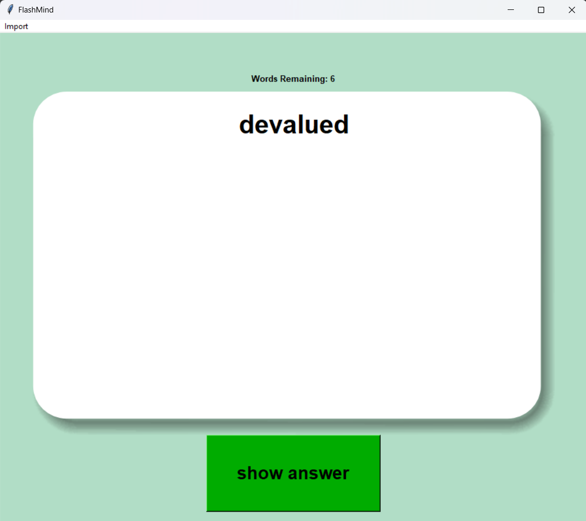
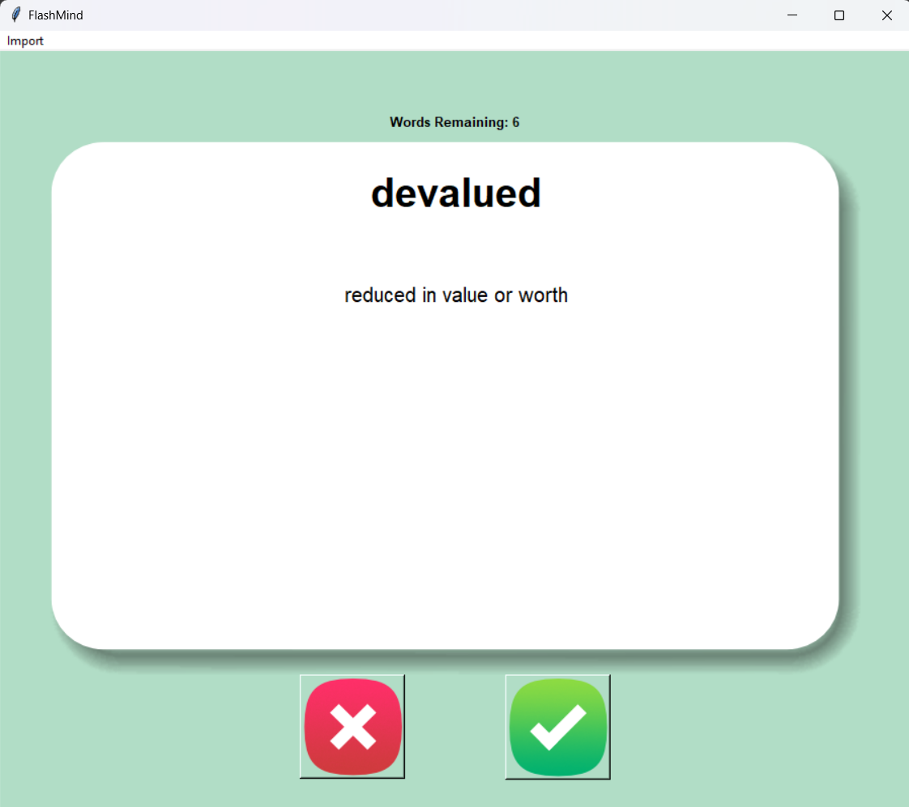
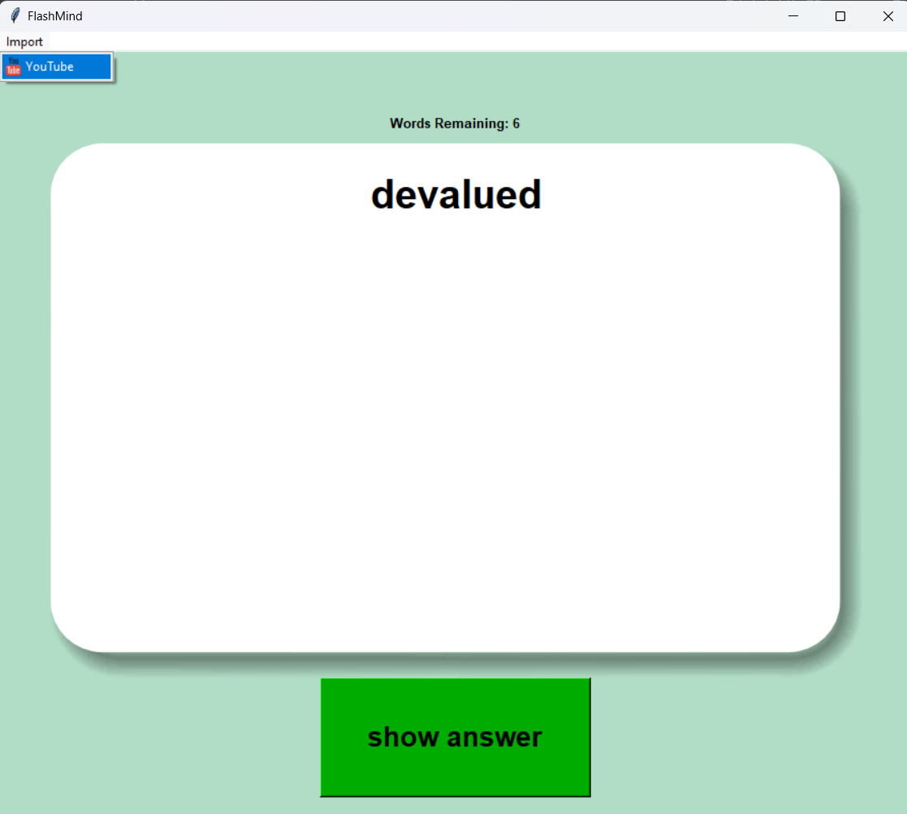
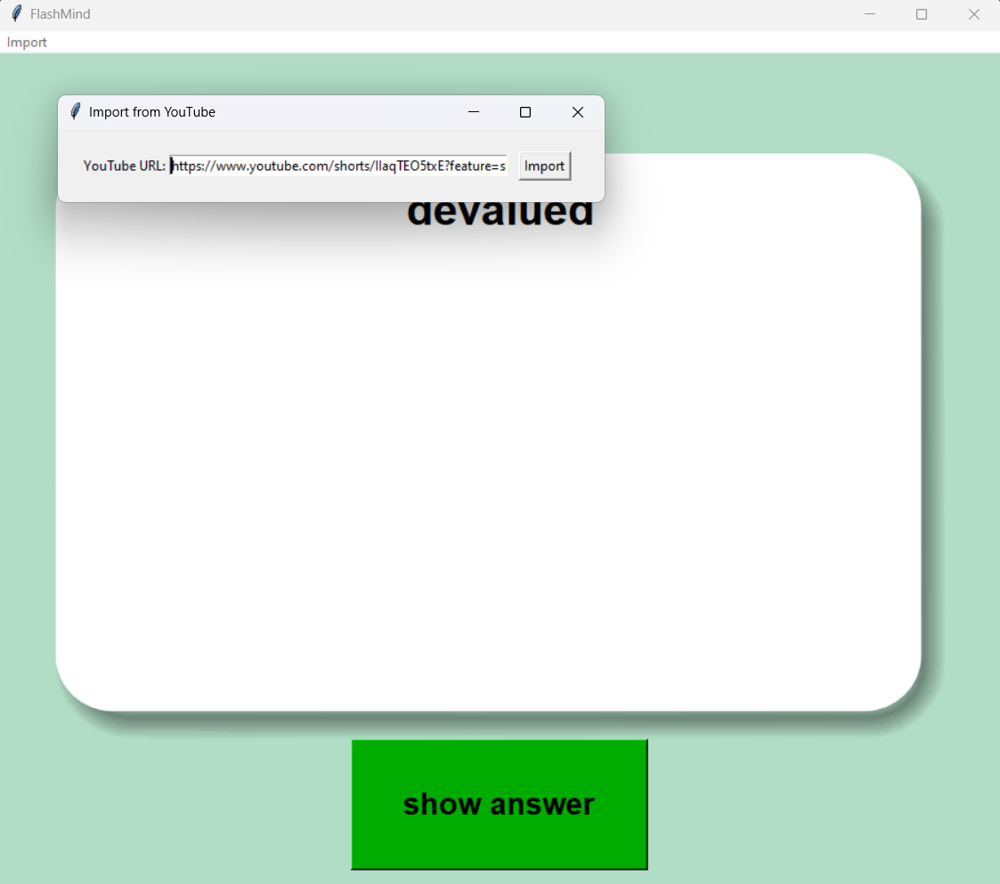

# Overview
The project focuses on creating a Flashcard App that can use LLM to extract words from youtube videos selected by the user. The app uses the following to extract the words from the video:
- Uses **FFmpeg library** to extract audio from videos
- Uses **OpenAI Whisper Small** ASR model from Hugging Face to create a transcription from the audio
- Uses **GPT4o mini** to extract the words from the text


# Requirements
Install packages in requirements.txt. Use the following code in terminal:

pip install -r requirements.txt


Also, FFmpeg need to be installed on your operating system. You can find FFmpeg package [HERE](https://www.gyan.dev/ffmpeg/builds/)
- Installation Instructions for Windows:[Click Here](https://phoenixnap.com/kb/ffmpeg-windows)
- Installation Instructions for Mac:[Click Here](https://phoenixnap.com/kb/ffmpeg-mac)


## Setup Instructions
To ensure the project works correctly, you need to set the `PYTHONPATH` environment variable to include the `./src` directory. This allows Python to correctly locate the project's modules.


### Setting `PYTHONPATH`

1. **For Linux/macOS**:
   Open a terminal and run the following command:
   ```bash
   export PYTHONPATH=./src
2. **For Windows**
    Open terminal and run the following command:
    ```powershell
    $env:PYTHONPATH="./src"


# OPENAI Configuration
You need to provide an OpenAI API Key for the project to work. OPENAI API is needed for the word extraction. You can do wither o the following two approaches to set the key in your system:
- **Environment Variable**: You can set the `OPENAI_API_KEY` environment variable in your system.
- **.env File**: Alternatively, you can create a `.env` file in the root directory of your project with the following content: OPENAI_API_KEY=your_openai_api_key_here


# How to Run the Application
To start the application, you need to run the `main.py` file, which is located in the `src` folder.

# GUI Details:
## Main window
- Show Button will show the meaning

## Second Window after presing `Show Answer Button`
- Right button (green): will remove the word from the word repository
- Wrong button (Red): will keep the word in the word repository

## Menu Bar: Import from Youtube window
- Click on import/Youtube
- In the Import from Youtube window, enter the youtube url and press `import` button




